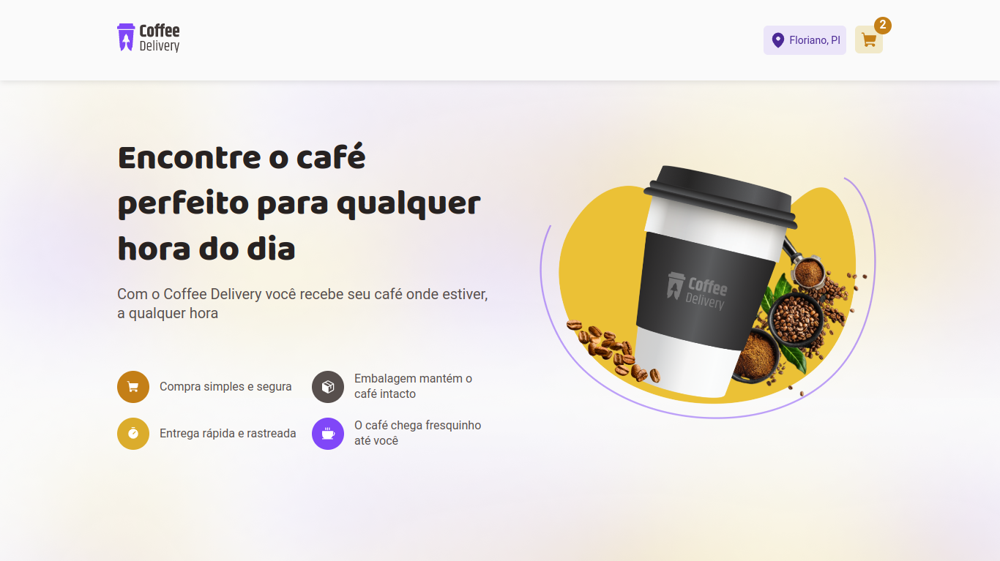
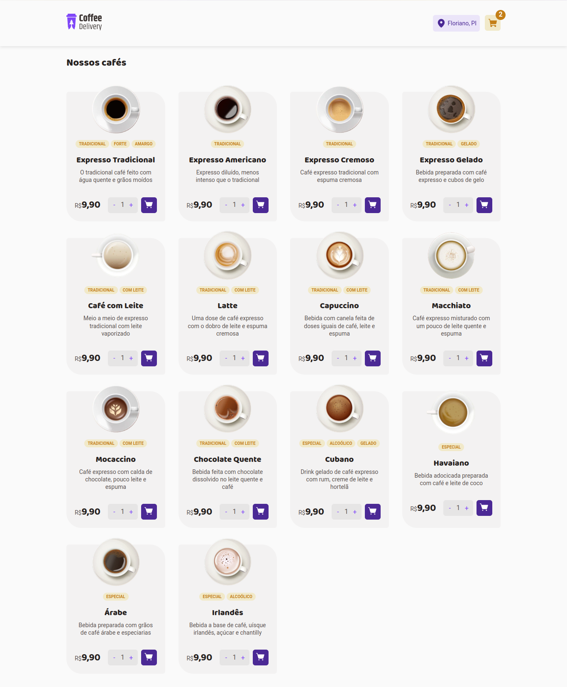
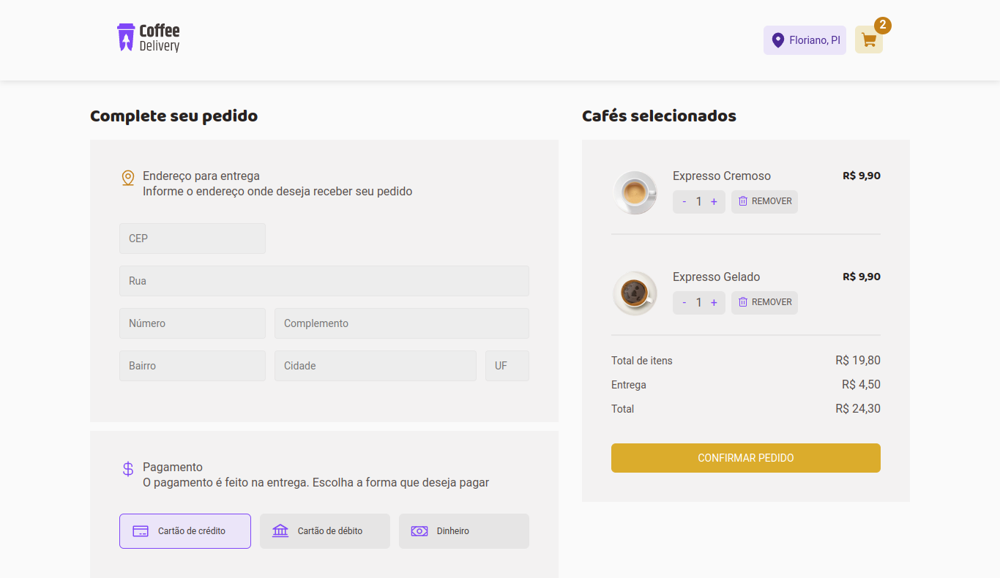
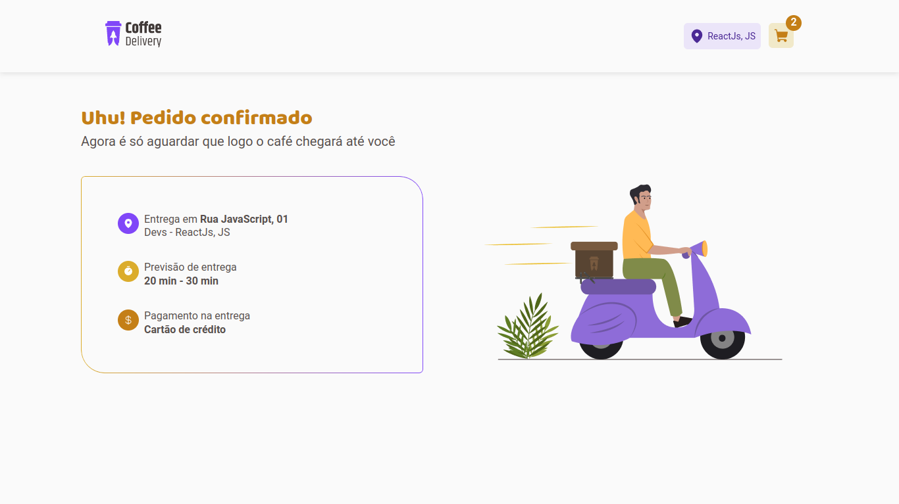

# ☕ Coffee Delivery

## Desafio de código!

Projeto desenvolvido durante a **Especialização no desenvolvimento Front-end** na [Rocketseat](https://www.rocketseat.com.br/).

## Sobre o projeto

Uma SPA (Single Page Aplication) aprofundado as habilidades com desenvolvimento mais avançado com o ReactJs e TypeScript abordando sobre ContextApi, useReducer, React Hook Form, Zod, React Router Dom, Immer.

## Techs utilizadas

- [ReactJs](https://pt-br.reactjs.org/)
- [Vite](https://vitejs.dev/)
- [TypeScript](https://www.typescriptlang.org/)
- [Phosphor Icons](https://phosphoricons.com/)
- [Git](https://git-scm.com/)

## Telas da aplicação

- Tela inicial
  

- Cardápio
  

- Tela de detalhes de pedido
  
  
- Tela de pedido finalizado
  

